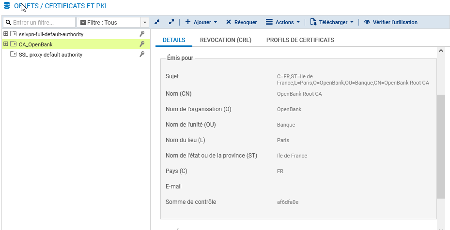
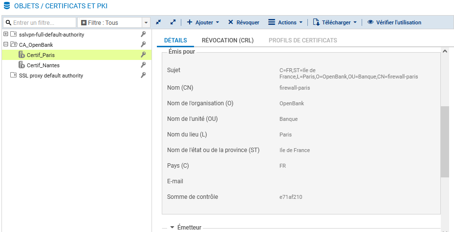
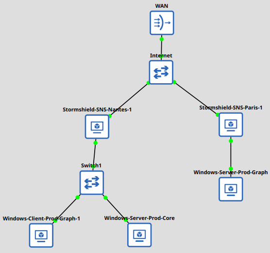
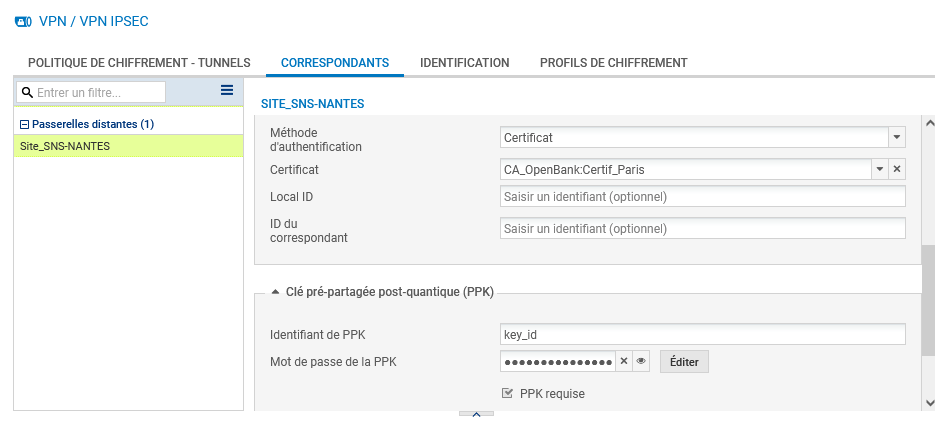
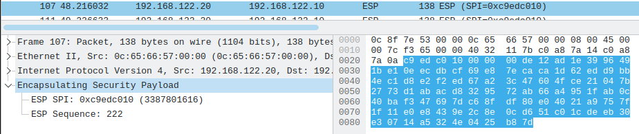
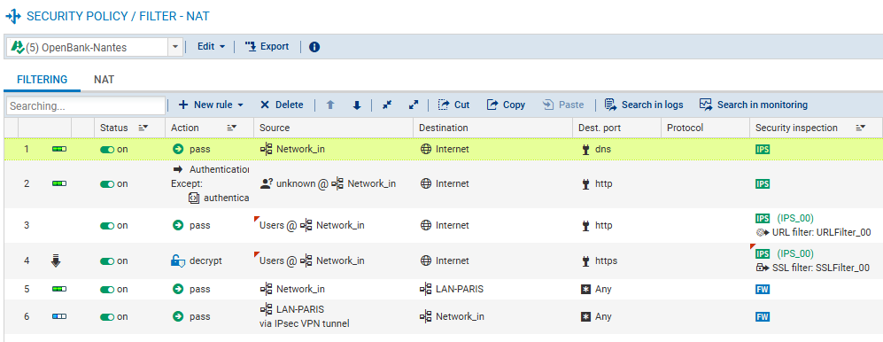
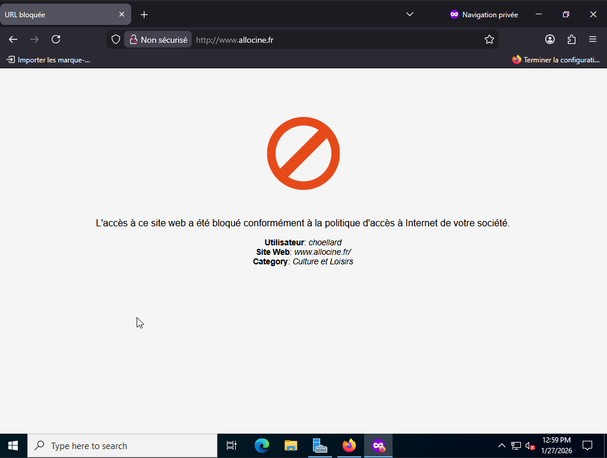
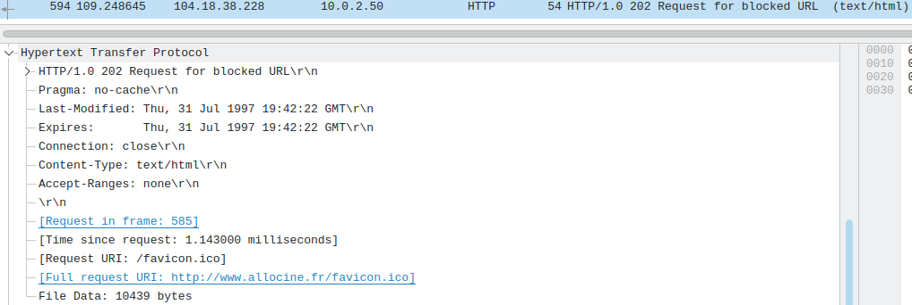
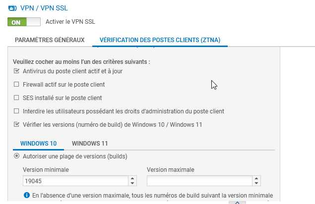
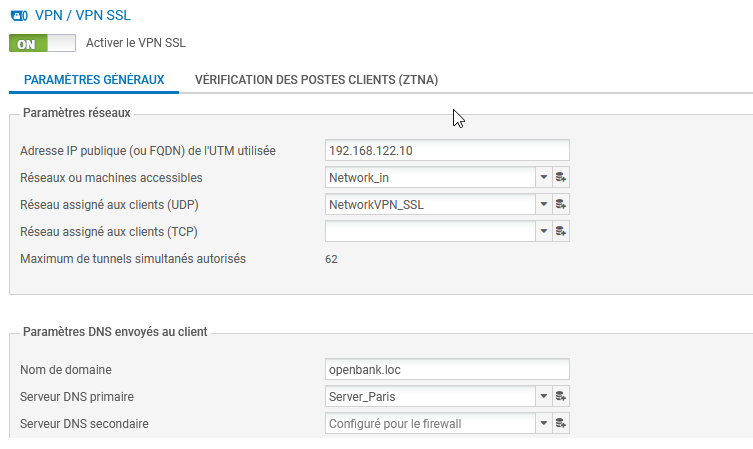

# Procédure de déploiement des nouvelles technologies de sécurité

> 📥 **Document Complet :** [Télécharger la Procédure Technique (PDF)](docs/Technical_Procedure_ZeroTrust_Deployment.pdf)

**PROJET :** Architecture Réseau OpenBank - Interconnexion et Télétravail  
**AUTEUR :** Hoëllard Calix  
**VERSION :** 1.0  

---

## 📋 Tableau de Versionning (Traçabilité)

| Version | Date | Auteur | Description des modifications | Validé par |
| :---: | :---: | :--- | :--- | :--- |
| **0.1** | 28/01/2026 | Calix Hoëllard | Création du document (Draft - Maquette) | - |
| **1.0** | 29/01/2026 | Calix Hoëllard | Validation des tests VPN, Proxy & ZTNA | Samir Assaf (DSI) |

---

## I. Introduction et Contexte

### A. Objectif
Ce document détaille la procédure technique pour la sécurisation de l'infrastructure réseau d'OpenBank. Il décrit les étapes de mise en œuvre de l'interconnexion sécurisée entre le siège (Paris) et la nouvelle agence (Nantes), ainsi que le déploiement d'une solution de télétravail conforme aux normes de sécurité modernes.

### B. Périmètre technique
Le déploiement concerne les équipements suivants :
* **Sécurité Périmétrique :** Firewalls Stormshield Network Security (SNS) sur les deux sites.
* **Systèmes :** Serveurs Windows 2022 (ADDS, DNS, DFS) et Postes clients Windows 10/11.
* **Architecture :** Réseau hybride (LAN Paris, LAN Nantes, Zones VPN).

### C. Contraintes et Accessibilité
Cette procédure intègre les contraintes de production suivantes :
* **Continuité de service :** Les interruptions sont planifiées hors heures ouvrées.
* **Accessibilité :** L'environnement de travail a été adapté pour les collaborateurs en situation de handicap (Mise en place des outils d'ergonomie pour Ana Garcia via GPO).

---

## II. Gestion des Certificats (PKI)

Afin de garantir une authentification forte des équipements et d'éviter les alertes de sécurité lors du déchiffrement SSL, une Infrastructure à Clés Publiques (PKI) interne a été déployée.

### A. Création de l'Autorité de Certification (CA)
> **Explication technique :** Nous avons choisi de créer une Autorité de Certification (CA) privée "OpenBank Root CA" directement sur le firewall principal. Cette approche permet de maîtriser la chaîne de confiance en interne.

*Fig 1. Interface de gestion PKI Stormshield montrant l'autorité racine interne valide.*

### B. Certificats Serveurs
Chaque pare-feu dispose de son propre certificat d'identité (Server Certificate) signé par la CA racine.

*Fig 2. Liste des certificats d'identité générés pour les pare-feux Paris et Nantes.*

---

## III. Interconnexion Site-à-Site (VPN IPsec)

L'interconnexion permanente entre Paris et Nantes est assurée par un tunnel VPN IPsec.

### A. Topologie et Adressage
Le schéma ci-dessous présente l'architecture validée en pré-production (GNS3), détaillant les plans d'adressage IP des interfaces WAN et LAN.

*Fig 3. Topologie réseau GNS3 complète avec routeur central simulant Internet.*

### B. Configuration du Tunnel & Sécurité Post-Quantique
> **Le point critique :** Conformément aux directives de l'ANSSI pour anticiper les futures menaces, nous avons activé la protection **Post-Quantique**.

Configuration du correspondant IKEv2 en mode Hybride : Authentification forte par Certificat X.509 associée à une **Clé Pré-Partagée Post-Quantique (PPK - RFC 8784)**.

*Fig 4. Configuration IKEv2 montrant l'authentification par certificat et la clé PPK.*

### C. Validation et Traçabilité
L'analyse réseau confirme que le trafic inter-sites est encapsulé (ESP) et illisible depuis Internet.

*Fig 5. Capture Wireshark confirmant l'encapsulation ESP.*

---

## IV. Sécurisation de la Navigation (Proxy & Filtrage)

Pour protéger le réseau interne des menaces web, un proxy HTTP/HTTPS avec authentification transparente a été mis en place, couplé à l'Active Directory.

### A. Règle de Firewall (ACL) dédiée au Proxy
Cette règle stipule que tout trafic venant du réseau interne à destination d'Internet sur les ports Web doit être redirigé vers le module Proxy URL.

*Fig 6. Règle de filtrage redirigeant le trafic HTTP vers le proxy interne.*

### B. Critères d'acceptation (Tests)
Le bon fonctionnement est validé par l'apparition de la page de blocage lors d'une tentative d'accès à un site de jeux.

*Fig 7. Page de blocage Stormshield "Accès Interdit".*

*Fig 8. Capture Wireshark montrant l'interception et le code 403 Forbidden.*

---

## V. Accès Distant (VPN SSL & ZTNA)

Le télétravail est sécurisé par un tunnel VPN SSL associé à une politique **Zero Trust (ZTNA)**.

### A. Configuration ZTNA (Conformité)
Le principe du ZTNA est de ne jamais faire confiance par défaut. Le firewall audite le poste client (appartenance au domaine) avant d'autoriser la connexion.

*Fig 9. Interface ZTNA exigeant que le poste soit membre du domaine AD.*

### B. Règle de Firewall (ACL) dédiée au VPN SSL
Une fois le tunnel monté, le trafic doit être explicitement autorisé par une règle de filtrage stricte (Réseau 10.60.0.0/24 vers LAN Paris).

*Fig 10. Règle autorisant le trafic du VPN SSL vers les ressources internes.*

### C. Validation (Critères d'acceptation)
Le test final valide l'accès aux ressources partagées (Sysvol/Netlogon) à travers le tunnel.

*Fig 11. Accès réussi aux dossiers partagés via le tunnel VPN SSL.*

---

## VI. Plan de Déploiement et Retour Arrière

### A. Phases de déploiement
1.  **Phase 1 (Pré-prod) :** Validation technique complète sur maquette GNS3 (J-2).
2.  **Phase 2 (Prod) :** Mise en production de 20h00 à 22h00.
    * Snapshot des VMs.
    * Déploiement certificats & VPN IPsec.
    * Ouverture service VPN SSL.

### B. Plan de Retour Arrière (Rollback)
En cas d'échec critique :
* **Immédiat :** Désactivation des règles de filtrage ZTNA et Proxy.
* **Restauration :** Rechargement de la configuration de sauvegarde "J-1" sur les firewalls.
* **Secours :** Bascule temporaire sur une authentification PSK simple.
